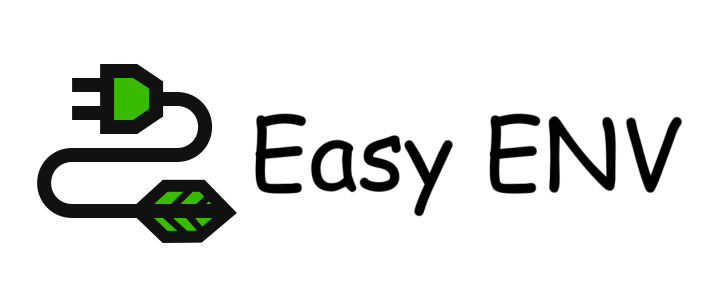

# Easy Env



`easy env` is a simple secure environment variable manager.

The language advantages of golang make it very easy to deploy and use.

`easy eny` plays an obvious role in development, construction and CI environments

- Support Console manager
- Support security tokens
- Local storage data security

# Dependency requirements

- `github.com/gin-gonic/gin`
- `github.com/fatih/color`
- `github.com/samber/lo`
- `github.com/spf13/cobra`

Minimum Supported Golang Version is 1.20.


# Getting started

**Download package**
[latest version 2.0.1](https://github.com/xxscloud5722/easy_env/releases)

**Program compilation**
- Goalng 1.9
- Node v16.x

```bash
# Admin UI
# npm
cd ./AdminUI
npm install && npm build

# Easy Server
cd ./Server
# windows OR linux
go env -w GOOS=linux
go mod tidy
go build -o ../dist/server src/main.go

# Easy Cli
cd ./Cli
# windows OR linux
go env -w GOOS=linux
go mod tidy
go build -o ../dist/cli src/main.go
```


# Easy Demo
Confirm that the program has been downloaded or programming is completed.

```bash
# start the server
# -t [token]    Assign token
# -a enable     Enable UI Console
./server -t fa4c7d95a39787f5b62b824b901950e4 -a enable

# cli help
envcli -help

```

# Contributors

Thanks for your contributions!

- [@xiaoliuya](https://github.com/xxscloud5722/)


# Zen
China's open source has changed its flavor and become a KPI indicator for promotion and salary increase, which goes against the spirit of open source.

Use this to warn self Staying true to our founding mission.